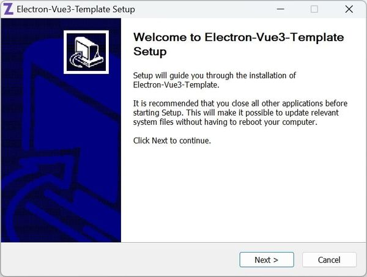

# 1. Electron Vue3模板
本项目是一个基于**Vue3** + **Electron** + **TypeScript**的客户端程序模板，包含**ViteJS**和**Electron Forge**。

## 1.1 关于
本模板使用[ViteJS](https://vitejs.dev)构建和驱动前端页面，支持热加载（HMR），可以使开发和调试变得更加高效 ⚡

使用Electron官方推荐的[Electron Forge](https://www.electronforge.io/)进行客户端的构建和打包，该模板还支持使用NSIS进行打包 😎

模板包含如下功能和特性：
- 支持Vue3多页面，提供页面创建指令 💖
- 支持Electron窗口创建指令，可隔离窗口事件 💖
- 主进程和渲染进程支持热加载 ⚡
- 集成AntDesign Vue、FontAwesome图标等常用组件
- 日志文件（主进程和渲染进程均可直接使用）
- 配置文件
- 文件下载（支持哈希校验、进度反馈）
- 功能完善的无边框窗口
- 托盘图标和右键菜单
- 关闭窗口时最小化到托盘
- 客户端程序单实例
- 主进程和渲染进程间的同步/异步调用
- 基于ESLint的代码规范和自动格式化
- 使用Electron Forge进行客户端构建和打包
- 支持NSIS安装包

## 1.2 快速开始

点击右上角绿色的**Use this template**按钮，使用该模板创建一个新的仓库并克隆到本地。

**或者..**

直接克隆该项目: `git clone https://github.com/winsoft666/electron-vue3-template.git`

### 1.2.1 Visual Studio Code
推荐使用`Visual Studio Code`进行项目开发，并安装如下插件：
- ESLint
- Vue Language Features (Volar)

### 1.2.2 安装依赖 ⏬

```bash
yarn install
```

### 1.2.3 开发 ⚒️

```bash
yarn run dev
```

### 1.2.4 其他命令

```bash
yarn run dev # 启动应用并支持热加载
yarn run build # 构建应用，可发布的包位于"out\make"目录

# 或者
yarn run build:win32 # 构建Windows平台 32位应用
yarn run build:win64 # 构建Windows平台 64位应用
yarn run build:mac # 构建macOS平台应用
yarn run build:linux # 构建Linux平台应用

yarn run new:page  # 创建新的Vue页面
yarn run new:window # 创建新的Electron窗口
```

更多的可选配置项可以参考 [Electron Forge CLI docs](https://www.electronforge.io/cli)。

### 1.2.5 NSIS安装包 🪟
需要先手动下载和安装NSIS：
[https://nsis.sourceforge.io/Download](https://nsis.sourceforge.io/Download)

使用如下命令构建Windows平台 32位应用（如需构建64位应用，则需要手动修改`win-setup-x86.nsi`脚本）：
```bash
yarn run build:win32
```

运行NSIS安装目录内的`makensisw.exe`。

依次点击`File -> Load Script...`，选择并加载本项目的`setup\NSIS\win-setup-x86.nsi`脚本。

最后，执行`Recompile`命令即可编译生成安装包。



# 2. 项目介绍
## 2.1 工程结构 🌳

```yaml
- scripts/          # 该目录中的脚本用构建应用程序和驱动前端页面
- screenshots      # 本文档中用到的截图
- setup/            # 存储编译和构建相关文件
  - NSIS/           # NSIS安装包脚本
- src/
  - lib/            # 公共库，为了方便修改，未做成独立的包
    - file-download/  # 文件下载库
  - main/           # 主进程的代码 (Electron)
    - static/       # 静态资源
    - windows/     # 多窗口文件夹 (每个子目录表示一个窗口)
  - renderer/      # 渲染进程的代码 (VueJS)
    - public       # 静态资源
    - pages/       # 多页面目录 (强制约定：每个子目录代表一个页面)
    - typings/     # ts声明文件
```

## 2.2 使用静态文件

- `src/main/static`目录存放主进程使用的静态文件。
- `src/renderer/public`目录存放渲染进程使用的静态文件。

#### 2.2.1 在主进程中引用静态文件

```ts
// 假设 src/main/static/tray.ico 文件存在
// 使用 appState.mainStaticPath 属性获取主进程的静态文件存储目录
import path from "path";
import { appState } from "./app-state";

const iconPath = path.join(appState.mainStaticPath, "tray.ico");
```

## 2.3 AppState对象
为了方便在主进程中跨模块访问某些对象（如`mainWindow`、`tray`、`cfgStore`等）和应用配置（如`onlyAllowSingleInstance`等），我们定义了单实例对象AppState来存储这些对象。

使用方法如下：
```javascript
import { appState } from "./app-state";

appState.mainWindow?.show();
```

## 2.4 创建Vue页面

执行如下命令，输入页面名称后将自动在`renderer/pages`目录创建子页面，每个子页面的相关代码位于单独的目录中，目录名为我们指定的页面名称（小写）。

```bash
yarn run new:page
```

创建的子页面在代码中通过以下方式访问：
```javascript
// 开发环境
const rendererPort = process.argv[2];
mainWindow.loadURL(`http://localhost:${rendererPort}/pages/<PAGE-NAME>/index.html`);

// 非开发环境
mainWindow.loadFile(path.join(app.getAppPath(), "build/renderer/pages/<PAGE-NAME>/index.html"));
```

## 2.5 创建Electron窗口
虽然直接构造Electron的BrowerWindow对象就可以创建新的Electron窗口，但为了方便代码管理和ipcMain消息隔离，本模板中的每个窗口都继承自`WindowBase`对象，每个窗口的相关代码位于`src\main\windows\`的不同子目录中，目录名为我们指定的窗口名称（小写）。

```bash
yarn run new:window
```

创建的子窗口默认会访问同名的子页面，可以手动修改代码指定其他页面：
```javascript
if(process.env.NODE_ENV === "development"){
  const rendererPort = process.argv[2];
  mainWindow.loadURL(`http://localhost:${rendererPort}/pages/main/index.html`);
}else{
  mainWindow.loadFile(path.join(app.getAppPath(), "build/renderer/pages/main/index.html"));
}
```

在`registerIpcMainHandler`方法中注册该窗口的ipcMain事件及处理函数。

当多个窗口注册了同名的事件时，渲染进程发送该名称的事件到主进程，所有窗口对象都会收到该事件，我们可以在事件处理函数中使用`isIpcMainEventBelongMe`方法过滤非本窗口的事件。

```javascript
ipcMain.on("message", (event, message) => {
  if(!this.isIpcMainEventBelongMe(event))
    return;

  console.log(message);
});
```

# 3. 代码规范
本项目使用ESLint进行代码规范的检查和自动格式化，没有使用Prettier进行代码格式化。

具体原因大体如下：
1. 需要额外的配置来避免ESLint和Prettier的部分规则冲突。

2. Prettier的`printWidth`配置项会损害代码和Git Diff的可读性。


[在线演示](https://prettier.io/playground/#N4Igxg9gdgLgprEAuc0DOMAEBXNcBOamAvJgNoA6UmmwOe+AkgCZKYCMANPQVAIYBbOGwogAggBsAZgEs4mAMJ98QiTJh9RmAL6cqNOrgIs2AJm5H8-ISJABxGf0wAlCGgAWfKFt37aPJlZMAGYLBmthTFEAZXdsAHNMADk+ACNsHz1qf0sTTAAWMN5BSNFnPncBL0wAMXw+Bky-QwY8gFYiqxLbABU3d3kAGQBPbFSEJuyW4yCANk6I22iCeJkIZJkJCCllSYBdAG4qEE4QCAAHGDWoNGRQZXwIAHcABWUEW5Q+CSe+YdvTql6mAANZwGDREqDRxwZA7CR4QHAsEQ858MCOeLIGD4bBwU5wATjZjMODMQZeeLYPjxOA1CAqPgwK5QLFfbAwCAnEDuGACCQAdXc6jgaDRYDgyxu6hkADd1MNkOA0ACQI4GDAXvV4lU4d9ESAAFZoAAe0UxEjgAEVsBB4HqEfiQGjCAQlak0nAJNzzvhHDABTJmDB3Mh8uZnY88AL6uclb7RQRZbDTgBHW3wLUXT4gBoAWigcDJZO5+Dg6ZkZa1NN1SHhBrwAhk2NxTrQFutGdhdf1To0qUDwdDSAjOL4m0xCggAlrIFFbW5Rh6aU+9adsrxjCgpNg0TAfsuYm30Rgw0tDrw2m0QA)

# 4. dependencies和devDependencies的区别 🎈
由于Electron Forge会将`dependencies`中的所有依赖项都进行打包，因此为了减少安装包的体积，我们只将主进程需要使用的依赖安装到`dependencies`项下，而其他的依赖均安装到`devDependencies`。

如将vue作为开发依赖进行安装：

```bash
yarn add -D vue
```

# 5. 客户端版本号
使用`package.json`文件的`version`字段标识客户端的版本号，在主进程内可以通过`appState.appVersion`属性获取。

💡 不需要设置`forge.config.js`文件的`appVersion`字段。

# 6. 依赖包说明
## unplugin-vue-components
使用`unplugin-vue-components`包实现自动按需引入AntDesign-Vue组件。

## electron-log
`electron-log`包提供本地日志文件的打印和输出。

## electron-store
`electron-store`包提供本地配置文件的读取和写入功能。

## @fortawesome-*
`@fortawesome-*`等包提供对FontAwesome图标字体的支持。

